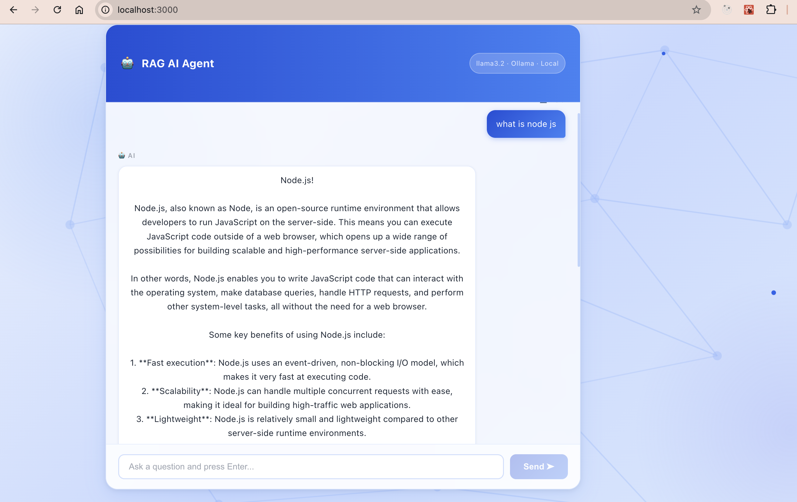

# Chat Bot RAG AI Agent

A local Retrieval-Augmented Generation (RAG) chatbot that answers questions about your documents using **Ollama** (llama3.2) and **LangChain**, with a React frontend.

## Screenshots

### Chat Interface


### AI Response


---

## Tech Stack

| Layer | Technology |
|-------|-----------|
| Frontend | React 19, TypeScript, Vite |
| Backend | Node.js, Express 5, TypeScript |
| LLM | Ollama (llama3.2) |
| Embeddings | Ollama (nomic-embed-text) |
| Vector Store | In-memory (LangChain MemoryVectorStore) |
| RAG Framework | LangChain / LangChain.js |

---

## Prerequisites

Make sure the following are installed before you begin:

- [Node.js](https://nodejs.org/) (v18 or higher)
- [Ollama](https://ollama.com/) — for running local LLMs

---

## Setup & Installation

### Step 1 — Install Ollama and pull required models

```bash
# Install Ollama (macOS)
brew install ollama

# Start the Ollama server
ollama serve

# In a new terminal, pull the LLM model
ollama pull llama3.2

# Pull the embeddings model
ollama pull nomic-embed-text
```

Verify Ollama is running at `http://localhost:11434`.

---

### Step 2 — Clone the repository

```bash
git clone https://github.com/krishkolluri/simple-rag-app.git
cd simple-rag-app
```

---

### Step 3 — Add your documents

Place any `.txt` files you want the AI to answer questions about inside:

```
backend/src/rag/data/docs/
```

These files are ingested into the vector store on server startup.

---

### Step 4 — Set up the backend

```bash
cd backend
npm install
```

Create a `.env` file in the `backend/` directory:

```env
PORT=5000
```

Start the backend server:

```bash
npm run dev
```

The server will:
1. Ingest all documents from `src/rag/data/docs/`
2. Start listening on `http://localhost:5000`

You should see:
```
✅ Docs ingested successfully
Server running on http://localhost:5000
```

---

### Step 5 — Set up the frontend

Open a new terminal:

```bash
cd frontend
npm install
npm run dev
```

The frontend will start at `http://localhost:3000`.

---

## Usage

1. Open `http://localhost:3000` in your browser.
2. Click one of the suggested questions or type your own question in the input box.
3. Press **Enter** or click **Send**.
4. The AI will retrieve relevant context from your documents and respond.

---

## Project Structure

```
simple-rag-app/
├── backend/
│   ├── src/
│   │   ├── config/
│   │   │   └── env.ts          # Environment variable config
│   │   ├── rag/
│   │   │   ├── chain.ts        # RAG chain — retrieval + LLM prompt
│   │   │   ├── ingest.ts       # Document ingestion & chunking
│   │   │   ├── store.ts        # Vector store & embeddings setup
│   │   │   └── data/docs/      # Place your .txt documents here
│   │   ├── routes/
│   │   │   └── chat.routes.ts  # POST /chat endpoint
│   │   ├── types/
│   │   └── server.ts           # Express app entry point
│   ├── .env
│   └── package.json
├── frontend/
│   ├── src/
│   │   ├── App.tsx             # Main chat UI
│   │   └── main.tsx
│   └── package.json
├── Input to chatbot.png
└── Output.png
```

---

## API

### `POST /chat`

**Request body:**
```json
{ "question": "What is Node.js?" }
```

**Response:**
```json
{ "answer": "Node.js is an open-source runtime environment..." }
```

---

## How It Works

1. **Ingest** — On startup, the backend reads all `.txt` files from `data/docs/`, splits them into 300-character chunks (with 50-char overlap), and stores them in an in-memory vector store using `nomic-embed-text` embeddings.
2. **Retrieve** — When a question arrives, the top 3 most similar chunks are retrieved from the vector store.
3. **Generate** — The retrieved context and question are combined into a prompt and sent to `llama3.2` via Ollama.
4. **Respond** — The answer is returned to the React frontend and displayed in the chat.
